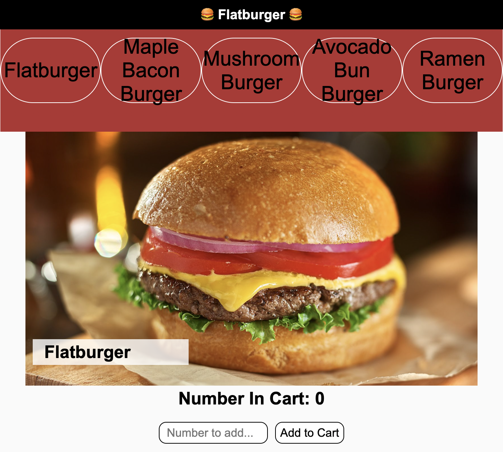

# Flatburger Lab

## Learning Goals

- Access information from an API using a GET request and use it to update the
  DOM
- Listen for user events and update the DOM in response

## Introduction

Today you'll be building an app for the Flatburger restaurant. You will be using a local API
and building out the frontend for our app.

> To view in VSCode, right click on the README.md file and select "Open Preview".

## Demo Image

Use this image as an example of how the app should look once it is complete.

## Setup

- Run `json-server --watch db.json` to get the backend started
- Run `npm install -g live-server` to install live-server globally
- Run `live-server` to start the frontend in browser
- Write your code in the `index.js` file

## Endpoints

Your base URL for your API will be: `http://localhost:3000`

The endpoints you may need are:

- GET `/burgers`
- GET `/burgers/:id`

## Core Deliverables

As a user, I can:

- See all burger names in the `div` with the id of `restaurant-menu`. When the page
  loads, fire a function called `addBurgerNamesToMenu` that requests the data from the server
  to get all the burger objects. Then, display the name for each of the burgers using a `span` tag inside the `#restaurant-menu` div.
- Click on a span from the `#restaurant-menu` div and fire a callback called `displayBurgerDetails` to see all the info about that burger displayed inside the `#food-detail` div (where it says `Image goes here`, `Name Of Burger`, and `[X]`).
- Attach a submit event listener to the `add-to-cart-form` form using a function called `addToCart`. After the submission, add the value from the input field to the burger displayed in the `div#food-detail`. **No persistence is needed**. The number in cart should be _cumulative_. For example, if a burger currently has 7 for the number in cart, and a user add another 7 to the number in cart via the form, the number in cart displayed for the burger should increase to 14.

** Attention here **: Your program should have a main() function that invokes `addBurgerNamesToMenu` and `addToCart` after the DOM has fully loaded and start the program logic.

## Advanced Deliverables

These deliverables are not required to complete this lab, but if you have
the extra time, or even after finishing the Core Deliverables, they are a great way to
stretch your skills.

> Note: If you are going to attempt these advanced deliverables, please be sure
> to have a working commit with all the Core Deliverables first!

As a user, I can:

- See the details for the first burger as soon as the page loads (without
  clicking on an span)
- Delete a burger name (you can add a "delete" button if you'd like, or use an
existing element to handle the delete action). The burger name should be removed
from the `restaurant-menu` div, and should not be displayed in the `food-detail`
div. No need to persist.
